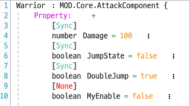

# MSW 1:1 격투 교안
<aside>
💡 [MSW 1:1 격투] 교안 소개
- 이 교안은 1:1 결투를 하는 교안입니다.  

- **❗MSW에 기본 개발 지식을 어느정도 보유하고 있다는 전재로 만들어졌습니다❗**

</aside>

## 시연 영상

[철권.mp4](images/%25EC%25B2%25A0%25EA%25B6%258C.mp4)

## 1. 클래스 만들기

### 1️⃣ 전사 클래스 만들기

- 전사 기본 공격, 더블점프, 특수공격을 담고있는 `Warrior` 컴포넌트
    - `Workspace` → `AttackComponent` 검색 후 우클릭 → `Extend`→ `Warrior`로 이름변경→ `DefaultPlayer`에 `Warrior` 컴포넌트 추가
        - ✏ `Warrior` 소스코드 전문 보기
            
            ## Property
            
            
            - Damage : 플레이어의 데미지
            - JumpState : 더블점프시, 현재 공중에 있는지 체크
            - DoubleJump : 더블점프를 사용했는지 체크
            - MyEnable : Event발생시 MyEnable이 true값일때만 동작하도록 설정을 위한 변수
            
            ## Function
            
            
            
            - NormalAttack: 기본공격을 위한 함수. 상대방 캐릭터에게도 보여야하므로 실행환경은 Server이다.
            - self:Attack(”공격범위”,”공격 위치 기준점”,”공격정보”) 함수를 통해, 함수 실행시 해당 범위에 공격을 가해줍니다.
            
            
            
            - 다른 Entity에서 HitComponent를 통해 공격이 감지되었을 경우, attackInfo (공격정보)  에 따른  데미지 차별화 해줍니다.
            
            
            
            - 상대방이 피격되었을때 OnAttack함수가 실행되는데, 밑의 IncreaseForce 함수에 피격한 상대 Entity (defender)를 인자로 넘겨줌으로써 실행합니다.
            
            
            
            - 특수공격을 관리하는 ForceManager 컴포넌트를 통해 게이지를 늘려주는 함수를 Client에서 실행 해당 ForceManager 컴포넌트는 `1-3 특수공격 게이지 관리 시스템` 에서 다룰 예정입니다.
            
            
            
            - 특수공격 함수
            - 전사의 특수공격은 앞으로 빠르게 전진하면서 경로에 있는 적들에게 데미지를 입히는 방식이다. 따라서 Effect를 넣어주고, Effect에 맞는 attakSize와 attackOffset의 값을 넣어준뒤, 기본공격과 같이 self:Attack 함수를 통해 범위 공격을 시전해주고, 데쉬를 해줌으로 스킬 쓴 플레이어를 해당 맵 포지션만큼 이동시켜줍니다.
            - 특수공격을 썼으므로 ForceManager 컴포넌트의 Force를 0으로 바꿔줍니다.
            
            ## Event Handler
            
            
            
            - Player가 Action을 취할때 발생하는 Event로, Attack (공격) Action이 발생할경우, 일반공격을 실행해주는 함수 (NormalAttack())를 실행합니다.
            
            
            
            - 더블점프 기능, 현재 점프중인 상태 (JumpState) 가 false이고, LeftAlt 키보드를 눌렀을때는, 땅에 붙어있는 상황이므로, 현재 점프중인 상태를 나타내는 JumpState 를 true로 바꿔줍니다.
            - 마찬가지로 LeftAlt가 눌렸을때 현재 점프중인 상황이라면, 더블점프가 실행되어야하므로, RigidbodyComponent:SetForce 함수를 통해 플레이어가 바라보는 방향으로 힘을 가해줍니다.
            - ㅡA를 누를경우, ForceManager 컴포넌트 안의 Force가 MaxForce보다 크거나 같은지를 확인한 후, SpecialAttack 함수를 실행해줍니다.
            
            
            
            - FootholdCollisionEvent를 통해, 발판과 닿을경우 다시 더블점프를 할 수 있게 DoubleJump 값을 true로 바꿔주고, 발판에 닿을경우 점프상태가 아니기때문에 JumpState값을 False로 만들어줍니다.
            

### 2️⃣ 궁수 클래스 만들기

- 궁수 기본 공격, 더블점프, 특수공격
    - `Workspace` → `AttackComponent` 검색 후 우클릭 → `Extend` → `Archer`로 이름변경→ `DefaultPlayer`에 `Archer` 컴포넌트 추가
        - ✏ `Archer` 소스코드 전문보기
            
            ## Property
            
            
            
            - Damage : 플레이어의 데미지
            - JumpState : 더블점프시, 현재 공중에 있는지 체크
            - DoubleJump : 더블점프를 사용했는지 체크
            - MyEnable : Event발생시 MyEnable이 true값일때만 동작하도록 설정을 위한 변수
            - Arrow : 궁수는 “화살”을 쏴야하기때문에 화살 Model을 담을 변수
            
            ## Function
            
            
            
            - 궁수 기본공격, 해당 함수 실행시 바라보는 방향에따라 같은방향의 화살 Model 생성후 Arrow 프로퍼티에 저장합니다.
            - 화살 Entity를 담은 Arrow의 ArrowAttack 컴포넌트에 방향을 나타내는 Direction 값을 플레이어가 쏜 방향으로 넣어줍니다.  해당 ArrowAttack은 밑에서 다룰 예정입니다.
            
            
            
            - 궁수 특수공격, 궁수의 특수공격은 화살을 윗방향으로 쏘는 모션(예시)으로, 해당 지역에 화살비를 내리는 공격입니다. 따라서 이펙트를 선정한 후, 해당 모션의 범위에 맞게 attackSize와 attackOffset 변수 조정, 화살이 쏟아지는 이펙트의 타이밍에 맞게 self:Attack(”공격범위”,”공격위치”,”공격정보”)를 통해 해당 범위 공격합니다.
            - 특수공격시 ForceManager 컴포넌트 안의 Force를 0으로 변경합니다.
            
            
            
            - Return 값으로기본공격과 특수공격에 맞는 데미지를 설정해줍니다.
            
            ## Event Handler
            
            
            
            - Player가 Action을 취할때 발생하는 Event로, Attack (공격) Action이 발생할경우, 일반공격을 실행해주는 함수 (NormalAttack())를 실행합니다.
            
            
            
            - 더블점프 기능, 현재 점프중인 상태 (JumpState) 가 false이고, LeftAlt 키보드를 눌렀을때는, 땅에 붙어있는 상황이므로, 현재 점프중인 상태를 나타내는 JumpState 를 true로 바꿔줍니다.
            - 마찬가지로 LeftAlt가 눌렸을때 현재 점프중인 상황이라면, 더블점프가 실행되어야하므로, RigidbodyComponent:SetForce 함수를 통해 플레이어가 바라보는 방향으로 힘을 가해줍니다.
            - A를 누를경우, ForceManager 컴포넌트 안의 Force가 MaxForce보다 크거나 같은지를 확인한 후, SpecialAttack 함수를 실행해줍니다.
            
            
            
            - FootholdCollisionEvent를 통해, 발판과 닿을경우, 다시 더블점프를 할 수 있게 DoubleJump 값을 true로 바꿔주고, 발판에 닿을경우 점프상태가 아니기때문에 JumpState값을 False로 만들어줍니다.
- 왼쪽방향 화살, 오른쪽방향 화살 Model 2개 생성, 화살 발사 매커니즘
    
    
    
    방향 전환은 `SpriteRendererComponent` → `FlipX` 활성화
    
    
    
    - `Workspace` → `AttackComponent` 검색 후 우클릭 → `Extend`→ `ArrowAttack` 으로 이름변경→ `화살 Model`에 `ArrowAttack` 컴포넌트 추가
        - ✏ `ArrowAttack` 소스코드 전문보기
            
            ## Property
            
            
            
            - Dur : 화살 생성 주기
            - Direction : 화살에 힘을 주는 방향
            - Damage: 화살의 데미지
            
            ## Function
            
            
            
            - OnUpdate 함수를 통해 Dur - delta를 해줌으로써 0이 되었을때는 _EntityService:Destroy(self.Entity)를 통해 화살 Entity 삭제 혹은 IsHit 변수를 통해, 맞았을경우 에도 화살 Entity 를 삭제합니다.
            - “화살”자채가 공격범위 이므로, 화살에 TriggerComponent를 추가해주고, 해당 TriggerBox의 크기만큼 공격범위 설정 (OnUpdate 함수이므로 화살이 이동할때마다 공격범위의 위치 갱신) 해줍니다.
            - 화살이 날아가야하므로 화살 Model에 RigidbodyComponent 추가 후, Gravity를 0으로 설정, SetForce 함수를 통해 화살의 방향으로 힘을 지속적으로 가해줍니다.
            
            
            
            - OnAttack 함수를 통해, 공격범위 안에 상대 Entity의 HitComponent가 존재한다면, 피격이 되었는지 확인해주는 IsHit 변수를 true로 변경합니다.
            - IncreaseForce 함수를 통해 피격시 쏜 Entity의 게이지 증가해줍니다.
            
            
            
            - Damage Property 만큼의 데미지가 들어가도록 설정
            
            
            
            - 특수공격을 관리하는 ForceManager 컴포넌트를 통해 게이지를 늘려주는 함수를 Client에서 실행 해당 ForceManager 컴포넌트는 `1-3 특수공격 게이지 관리 시스템` 에서 다룰 예정입니다.
            
            ## Event Handler
            
            
            
            - FootholdCollisionEvent를 통해 지형에 화살이 닿았을경우, IsHit을 true로 바꿔줍니다.

### 3️⃣ 특수공격 게이지 관리 시스템

- 특수공격 게이지 관리
    - `WorkSpace`→ `DefaultPlayer` 우클릭 → `Add New Component` → `ForceManager` 이름변경
    - 특수공격에는 게이지 시스템이 들어갑니다. MaxForce 일때만 작동하도록 하고, Warrior, Archer 컴포넌트에서 OnAttack 함수안에서의 실행을 통해 상대방 Entity를 파라미터로 가져옵니다.
    - OnAttack함수에서는 defender(상대 플레이어)가 Hit되었을때만 발생되므로, ForceManager 컴포넌트 안의 IncreaseForce 컴포넌트가 Call back 함수 개념으로 실행됩니다.
        - ✏ `ForceManager` 컴포넌트 소스 코드 전문 보기
            
            ## Property
            
            
            
            - MyEnable : 해당 Component 안의 함수 실행유무를 확인하는 변수
            - Force : Player의 현재 Force
            - MaxForce: Player의 MaxForce
            
            ## Function
            
            
            
            - Warrior, Archer, ArrowAttack 컴포넌트에서 실행하는 함수, 피격자인 defender를 파라미터로 넘겨주고, 현재 ForceManager를 가진 공격자와 피격자가 다를경우, 자신의 Force를 20 늘려줍니다.
            
            ## Event Handler
            
            None
            
    

### 4️⃣ 게임 시작시 Player 세팅

- 해당 교안대로 제작시, “A”키를 누르면 특수공격이 나가게 됩니다. 따라서 기존 W,A,S,D 에 할당되어있는 ActionKey들을 모두 삭제해줍니다.
    - `DefaultPlayer` → `PlayerBeginSetting 컴포넌트 생성 후 추가`
        - ✏ `PlayerBeginSetting` 컴포넌트 소스 코드 전문 보기
            
            ## Property
            
            None
            
            ## Function
            
            
            
            - W,A,S,D 에 할당되어있는 ActionKey를 제거해줍니다.
            
            ## Event Handler
            
            None
            
        

---

## 2. 매칭시스템

### 1️⃣ 상대방 매칭 후 인스턴스 맵 입장

- `MSW 플랫폼` → `만들기`→ `새로만들기`→ `인스턴스맵 생성`
    
    
    
- `Workspace`→ `Scripts 폴더 안의 소스코드 활용`
    
    
    
- `MatchSystem` → `PlayerMatch : DefaultPlayer`에 컴포넌트 추가
- `MatchSystem` → `MatchUI` → `UIMatch : UI중 준비버튼에 컴포넌트 추가`
- `MatchSystem` → `MatchUI` → `UIExitButton : UI중 나가기 버튼`에 컴포넌트 추가
- `MatchSystem` → `MatchLogic중 Property에서 minPlayerCnt (최소인원), maxPlayerCnt(최대인원) 변경`
    - ✏`MatchLogic` Property 변경 부분
        
        
        
- 1:1 격투가 진행될 FightingMap 을 생성해줍니다.
    
    
    
- `FightingMap 의 Property` → `MapComponent` → `InstanceMap` 을 체크해줍니다.
    
    
    

---

## 3. 맵 기본 UI

### 1️⃣ 자신과 상대방의 Hp, 특수공격 게이지 연결

- 인스턴스 입장시 나의 Hp, 게이지 및 상대방의 Hp,게이지와 라운드, 시간 등 표기
    - 격투의 느낌이 나도록 UI 디자인
    
    
    
    
    
- `**FightingMap 에 FightMapEnterUI 컴포넌트 생성 후 추가**`
    - ✏ `FightMapEnterUI` 소스 코드 전문보기
        
        ## Property
        
        
        
        - FightUI : UI의 FightMapGroup 을 연결해주는 Proeprty
        - Player1_*** : Player와 UI의 이름, Hp bar, Force bar 연결해주기 위한 변수 생성
        - Player1, Player2 : 각 Player1과 Player2의 정보를 담고있는 변수
        - ClassSelectUI : 직업선택을 하는 UI
        
        ## Function
        
        
        
        - 해당 UI와, Timer를 실행시켜주는 함수입니다.
        
        
        
        - 각 Player1과, Player2의 UI를 연결해주는 함수. 대결 시작전 InputSpeed와 JumpForce를 0으로 만들어 대기상태로 만들어줍니다.
        - 또한 각 Player의 Hp를 MaxHp로 만들어줍니다.
        
        
        
        - OnUpdate 함수를 통해 Hp, Force를 연결한 UI의 SliderComponent 안의 Value (0~1사이 값)를 통해 실시간으로 Player1과 Player2의 현재값/최대값 으로 바꿔줍니다.
        
        ## Event Handler
        
        
        
        - UserEnterEvent를 통해 FightingMap에 입장한 Player들의 정보를 playersArr에 담아주고, FightMap의 UI를 실행시켜주는 SetFightUI함수를 실행시켜줍니다.
        - 입장한 Player의 수 (UserNum)이 2가 되었을때, 2명이 입장한것이므로, playersArr[1] 과 Player1의 UI, playersArr[2]와 Player2의 UI를 연결해주고, 각각 위치로 이동시켜줍니다.
        - Player1과 Player2에 각각 입장한 유저의 Entity를 연결해줍니다..

### 2️⃣ 직업선택 UI

- 사진 가운데 직업선택할 수 있는 UI 만들기
    
    
    
    - `UI에디터 버튼 클릭`
    
    
    
    - `+버튼 클릭`→ `ClassUI` 생성
    
    
    
    - 적당한 모양의 UI 제작. 검과 화살그림은 버튼으로 생성
        
        
        
        
        
    - `Hierarchy` → `ClassUI` → `UISprite` → `Warrior` 에 `Class_Archer_Btn` 컴포넌트 생성 후 추가
        - ✏ `Class_Archer_Btn` 소스코드 전문 보기
            
            ## Property
            
            
            
            - ClassSelect: ClassUI_Select (확인버튼) UI와 연결된 변수
            
            ## Function
            
            
            
            - 해당 버튼을 클릭했다면, Archer 컴포넌트만 활성화해주고, Warrior 컴포넌트는 비활성화해주는 함수입니다.
            
            
            
            - Player의 정보를 반환해주는 함수
            
            ## Event Handler
            
            
            
            - ButtonClickEvent로 버튼을 클릭할시, 해당 버튼을 클릭한 Player를 파라미터로 전달해서 Archer 컴포넌트가 활성화되게 해주고, 확인버튼 UI (ClassSelect)를 활성화해줍니다.
            
            ## Event Handler
            
    - `Hierarchy` → `ClassUI` → `UISprite` → `Archer`에 `Class_Warrior_Btn` 컴포넌트 생성 후 추가
        - ✏ `Class_Warrior_Btn` 소스코드 전문 보기
            
            ## Property
            
            
            
            - ClassSelect: ClassUI_Select (확인버튼) UI와 연결된 변수
            
            ## Function
            
            
            
            - 해당 버튼을 클릭했다면, Warrior 컴포넌트만 활성화해주고, Archer 컴포넌트는 비활성화해주는 함수입니다.
            
            
            
            - Player의 정보를 반환해주는 함수
            
            ## Event Handler
            
            
            
            - ButtonClickEvent로 버튼을 클릭할시, 해당 버튼을 클릭한 Player를 파라미터로 전달해서 Warrior 컴포넌트가 활성화되게 해주고, 확인버튼 UI (ClassSelect)를 활성화해줍니다.
            
- 직업 확정 UI
    - 확인버튼을 누르면, 직업이 확정해 전투중 직업을 바꿀 수 있게 하지 못하는 작업을 해줍니다.
        
        
        
    - `UI Editor` → `+버튼 클릭` → `ClassSelect 생성`
        
        
        
    - `Hierarchy` → `ClassSelectUI` → `UIButton 에 ClassSelectUI 컴포넌트 생성 후 추가`
        - ✏ `ClassSelectUI` 컴포넌트 소스 코드 전문 보기
            
            ## Property
            
            
            
            - ClassUI : 위에 만든 Class UI와 연결
            - ClassSelectBtn : 확인 버튼과 연결
            - Ready : 플레이어가 확인버튼을 누른지 확인을 위한 변수
            
            ## Function
            
            
            
            - 확인버튼을 누를시, ClassUI와 ClassSelectBtn 을 숨겨주는 함수입니다.
            
            
            
            - Player가 ClassSelectBtn을 클릭할 경우, Ready 값을 true로 바꿔주는 함수입니다.
            
            ## Event Handler
            
            
            
            - ButtonClickEvent를 통해 ClassUI_Select 버튼을 클릭할 경우, Class 관련 UI를 숨겨주고, HitComponent, ForceManage의 Enable를 true값을 바꿔준 뒤, Ready 값을 true로 바꿔줍니다.
            

## 4. 라운드 시스템

### 1️⃣ 타이머

- 타이머의 시간은 서버에서 받아야 플레이어간 시간 차이가 발생하지 않습니다. 따라서 전투가 치뤄지는 FightingMap 에서 시간을 측정하고, 각 Player가 그 시간을 받아 UI에 연결시켜야 플레이어 모두 같은 시간을 보게 됩니다.
    
    
    
    - `FightingMap의 Property` → `TimerScript` 컴포넌트 생성 후 추가
        - ✏ `TimerScript` 컴포넌트 소스 코드 전문보기
            
            ## Property
            
            
            
            - Time: 현재 시간을 담아내는 변수 (Buffer 역할)
            - sec: 현재 시간을 초단위로 저장하는 변수
            - MyEnable: 타이머 작동여부를 확인하는 변수
            
            ## Function
            
            
            
            - time 변수 안에 delta를 더해주고 해당 변수를 1초단위가 되었을때 local sec 변수에 넣어주고, 현재 시간인 self.sec과 다를경우, self.sec의 값을 바꿔주는 함수입니다.
            
            
            
            - Timer를 초기화 시켜주는 함수
            
            
            
            - 시간을 받아오는 함수
            
            
            
            - Timer의 작동여부를 boolean 타입의 파라미터를 통해 바꿔주는 함수입니다.
            
            ## Event Handler
            
            None
            
    - 서버에서 시간을 측정하면, 각 Client에 시간을 받아와 UI중 시간과 관련된곳에 연결해줘야 합니다.
        - `DefaultPlayer`→ `PlayerTimer` 컴포넌트 생성 후 추가
        - ✏ `PlayerTimer` 컴포넌트 소스 코드 전문보기
            
            ## Property
            
            
            
            - Time: 시간과 관련된 UI와 연결하는 변수
            - Maptimer : TimerScript 컴포넌트를 가지고 있는 FightMap과 연결한 변수
            - sec: 현재 시간
            - m: 분 단위를 표시할 변수
            - s: 초 단위를 표시할 변수
            
            ## Function
            
            
            
            - 서버에서 가져온 시간과 Component 안의 sec변수가 다를경우, 서버의 시간을 가져오고, UI에 적용시키는 함수입니다.
            
            
            
            - 서버에서 가져온 시간을 UI에 맞게 분, 초로 표시해 UI에 적용하는 함수입니다.
            
            # Event Handler
            
            None
            

### 2️⃣ 라운드 시작 카운팅

- 결투에는 라운드 시스템이 존재합니다. 플레이어 두명이 모두 준비완료되면 라운드를 시작합니다.
    - Round를 관리해주는 `RoundManager` 컴포넌트를 FightMap에 넣어줍니다.
    - `FightingMap`→ `RoundManager` 컴포넌트 생성 후 추가
        - ✏ `RoundManager` 컴포넌트 소스 코드 전문 보기
            
            ## Property
            
            
            
            - Timer: 타이머와 연결된 변수
            - PlayerNScore : 각 플레이어가 이긴 Round수를 담고있는 변수
            - P1, P2 : 현재 맵의 Player와 연결된 변수
            - P1,P2 Ready : 각 플레이어의 준비상태를 나타내는 변수
            - RoundCound : 라운드 카운팅을 실행했는지 여부를 확인하는 변수
            - Round: 현재 라운드 수
            - P*R* : 라운드 승리시, 승리한 라운드의 UI인 Component
            - MyEnable : 함수의 동작여부를 관리하는 변수
            - Period, Period2 : OnUpdate 함수를 다루므로, 실행 주기를 정해 순차실행을 어느정도 보장해주게 하는 변수
            
            ## Function
            
            
            
            
            
            
            
            
            
            
            
            - 각 플레이어가 승리시 밑의 그림에 있는 Timer 옆 승리 라운드를 표시하기 위한  함수입니다.
            
            
            
            
            
            - 각 플레이어가 라운드 승리시, 해당 네모모양의 UI의 Color를 바꿔주고, 2라운드 먼저 승리시, 결과 UI를 띄워줍니다.
            - 각 경우의 수에 따라 바뀌는 UI의 종류가 다르므로 코드가 길어졌지만, 단순히 점수로 나타낼 경우 (ex) 1:1) 코드를 압축시킬 수 있습니다.
            - 각 경우는 플레이어가 0점인 상황, 1점인 상황, 2점인 상황, 무승부에서는 두명 다 Round가 올라가는 상황을 담았고,  플레이어가 2라운드 승리시 Result UI가 나오는것, 아닐경우 RoundUI가 나오도록 하는 코드입니다.
            
            
            
            - 라운드 종료시, 각 Player를 원위치로 바꾸고 Hp를 최대치로 채워주고 게이지를 0으로 초기화, 움직일 수 없게 InputSpeed와 JumpForce를 모두 0으로 만들어줍니다.
            
            ## Event Handler
            
            
            
            - 해당 맵에 들어온 player를 각각 P1, P2에 저장해주고 MyEnable를 true로 바꿔줍니다.
- 라운드 시작시, 카운팅을 해주는 UI 및 RoundCount 컴포넌트 입니다.
    
    
    
    
    
    - `RoundUI 그룹 추가`
        
        
        
    - `DefaultPlayer`→ `RoundCount` 컴포넌트 생성 후 추가
        - ✏ `RoundCount` 컴포넌트 소스 코드 전문 보기
            
            ## Property
            
            
            
            - RoundCount : 라운드를 카운팅할 UI중, 숫자를 셀 Text와 연결된 변수
            - RoundUI : 라운드 카운팅할 UI와 연결된 변수
            - FightingMap : FightingMap과 연결된 변수
            
            ## Function
            
            
            
            - RoundManager 컴포넌트에서 해당 함수를 실행시키면, 3,2,1 초를 세면서 Text를 변경해주고, 멈춰두었던 InputSpeed, JumpForce를 원상태로 바꾼뒤, Timer를 초기화 시킵니다. 또한 PlayerTimer의 Enable를 true로 바꿔줘서 타이머가 다시 작동하도록 변경해주고, Fight!라는 문구를 띄워준뒤 UI를 꺼줍니다.
            
            ## Event Handler
            
            None
            

### 3️⃣ 시간종료 or 플레이어 Hp가 0이 되었을때 라운드 종료 및 결과 UI 표시

- RoundManager 컴포넌트에서 각 상황에따른 RoundUI, ResultUI를 표시하게 했습니다. 이것을 관리해주는 컴포넌트 입니다.
    - 각 라운드가 끝나면 라운드의 결과를 표시해주고, 최종 승리자가 나올시 해당 UI도 띄워주는  작업을 해줍니다.
    - `RoundScore 그룹 추가`
        
        
        
        
        
    - `ResultUI 그룹 추가`
        
        
        
        
        
    - `UI` → `ResultUI`→ `MainBoard`→ `ReturnToLobby` → `WorkSpace - MyDesk - Scripts - MatchSystem - MatchUI - UIExitButton` 컴포넌트 추가
        - 해당 버튼에, **`2. 매칭 시스템`** 에서 가져온 UIExitButton 컴포넌트를 추가해, 해당 버튼 클릭시 인스턴스맵을 탈출하도록 해줍니다.
    - `DefaultPlayer`→ `RoundUI` 컴포넌트 생성 후 추가
    - ✏ `RoundUI` 컴포넌트 소스 코드 전문 보기
        
        ## Property
        
        
        
        - roundUI: RoundScoreUI 의 Text와 연결된 변수
        - resultUI: ResultUI 의 승리자의 Text와 연결된 변수
        - resultUI2: ResultUI 의 Score Text와 연결된 변수
        - RoundUISet: RoundScoreUI 와 연결된 변수
        - ResultUISet: ResultUI 와 연결된 변수
        - P*R*: Player1과 Player2의 각 UI와 연결된 변수
        - Round: FightMapGroup 의 Round와 연결된 변수
        
        ## Function
        
        
        
        - 플레이어중 한명이 라운드 승리시 색을 바꿔줘야하는 부분의 이름을 String으로 넘겨받아, 해당 UI의 Color를 바꿔주는 함수입니다.
            
            
            
        
        
        
        - 결과창을 띄워주고, 해당 UI의 승리자 이름 및 Score를 변경해주는 함수입니다.
        
        
        
        - 라운드 승리시 라운드의 승리자의 값을 변경하는 함수입니다.
        
        
        
        - 무승부 결과가 나올경우 해당 UI를 바꿔주는 함수입니다.
        
        
        
        - 라운드 무승부가 나올경우, 해당 UI를 바꿔주는 함수입니다.
        
        
        
        - FightMap UI중 Round를 표시하는 Text를 바꿔주는 함수입니다.
        
        ## Event Handler
        
        None
        
- 최종 결과가 나오고 대기맵으로 이동할때 FightingMap 에서 사용하던 UI, 결과창 UI등을 모두 꺼주고, 대기맵에서는 서로를 공격할 수 없게 설정해주고, Class를 선택할 수 있는 UI를 켜줘야 합니다.
    - `DefaultPlayer`→ `UIExitBtn` 컴포넌트 생성 후 추가
    - ✏ `ExitUIBtn` 컴포넌트 소스 코드 전문 보기
        
        ## Property
        
        
        
        - 각 Property의 변수들은 FightingMap의 UI와 연결된 변수들입니다.
        
        ## Function
        
        
        
        - 모든 UI를 꺼주는 함수입니다.
        
        
        
        - 대기방으로 돌아갈때, ClassUI를 켜주는 함수입니다.
        
        ## Event Handler
        
        
        
        - ResultUI의 ReturnToLobby 버튼을 클릭했을때, 모든 UI를 꺼주고, ClassUI만 켜주는 Event Handler 입니다.